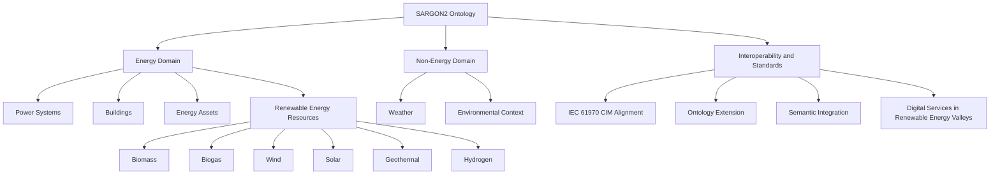
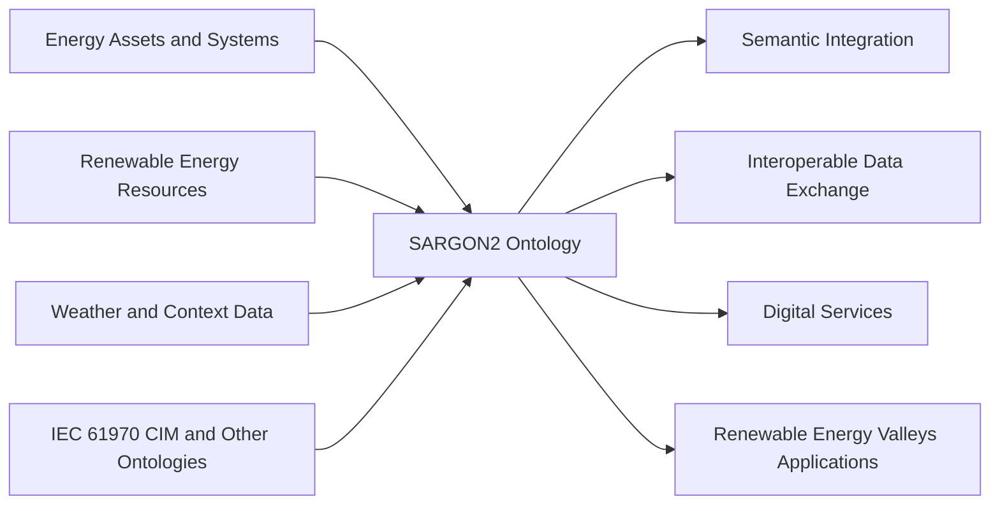

# SARGON2 Ontology

## Overview

**SARGON2** is an ontology for the energy domain that covers both **building-related energy concepts** and **non-energy contextual concepts**, such as **weather**. It is designed to extend and complement existing ontologies in order to support **digital services in the energy sector** and enable the **seamless semantic integration of energy assets in Renewable Energy Valleys**.

The ontology places special emphasis on **renewable energy resources**, including:

- biomass
- biogas
- wind
- solar
- geothermal
- hydrogen

A central objective of SARGON2 is to represent the necessary concepts and relationships in **power systems** while aligning with the **IEC 61970 Common Information Model (CIM)** standard.

---

## Purpose

The main purpose of SARGON2 is to provide a semantic model that supports:

- interoperability between heterogeneous energy data sources
- semantic integration of assets, systems, and contextual information
- digital services and data-driven applications in the energy sector
- modeling of renewable energy resources and their related entities
- alignment with standardized power-system concepts

---

## Scope

SARGON2 covers multiple domains relevant to modern energy systems.

### 1. Energy Domain
The ontology includes concepts related to:

- power systems
- energy assets
- buildings
- renewable energy resources
- generation and related infrastructure

### 2. Non-Energy Domain
The ontology also includes supporting contextual concepts, such as:

- weather
- environmental conditions
- external contextual information relevant to energy systems

### 3. Renewable Energy Focus
A particular focus is placed on the representation of renewable energy entities, including:

- biomass
- biogas
- wind
- solar
- geothermal
- hydrogen

---

## Alignment and Interoperability

SARGON2 is developed with a strong focus on **semantic interoperability**.

It aligns with the **IEC 61970 CIM standard** in order to cover important components of power systems in a standardized and reusable way. In addition, it is intended to act as an extension layer for other ontologies that are relevant to digital services in the energy sector.

This makes SARGON2 suitable for semantic integration tasks where data from different systems, domains, or asset types must be combined in a consistent manner.

---

## Key Features

- Representation of both energy and non-energy concepts
- Support for renewable energy resource modeling
- Integration of weather and contextual information
- Alignment with IEC 61970 CIM
- Support for semantic interoperability in Renewable Energy Valleys
- Reusable ontology structure for digital services in the energy sector

---

## Main Domain Areas

The following diagram gives a high-level overview of the ontology scope.

---

## Conceptual Role of the Ontology

SARGON2 can be understood as a semantic integration layer between domain knowledge, data sources, and digital services.

---

## Example Application Areas

SARGON2 can be used in applications such as:

- semantic modeling of energy assets
- integration of renewable energy data
- interoperability between energy platforms
- digital twins in the energy sector
- energy data exchange and harmonization
- Renewable Energy Valleys use cases
- contextual energy analytics combining operational and weather data

---

## Repository Content

This repository contains the ontology and related files.

Typical contents may include:

- the ontology file(s)
- supporting RDF/OWL resources
- documentation
- examples or test files
- scripts for ontology processing or validation

---

## Intended Users

This ontology is intended for:

- ontology engineers
- researchers
- semantic web developers
- energy-domain experts
- interoperability and data integration projects
- digital service developers in the energy sector

---

## Version Information

- **Ontology name:** SARGON2
- **Version:** 2.0
- **Issued date:** 2025-03-25

---

## License

This ontology is distributed under:

- **CC BY 4.0**
- https://creativecommons.org/licenses/by/4.0/

---

## Authors / Maintainers

- **Author:** Su Mon Tun, Than Myint Hlaing, Zhiyu Pan
- **Organization:** ACS RWTH

---

## Summary

SARGON2 is a domain ontology for energy systems that combines:

- energy-domain knowledge
- renewable energy resource modeling
- weather and contextual information
- semantic interoperability support
- IEC 61970 CIM alignment

Its main role is to support semantic integration and digital services in the energy sector, especially in the context of **Renewable Energy Valleys**.
